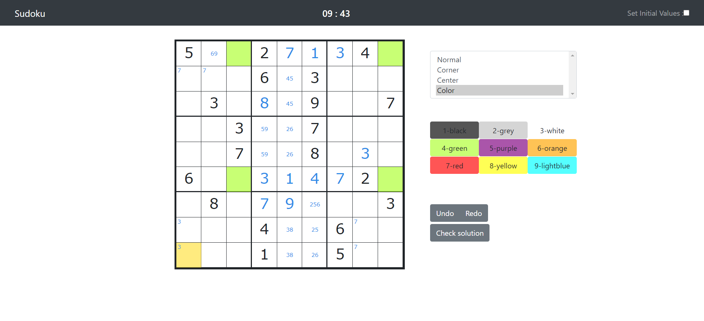

# sudoku_gui
A GUI to easily solve sudoku inspired by Cracking The Cryptic Web App

Input the initial values (they will be in black), then, uncheck the "Set initial values" checkbox.  
From this moment, the controls are the same as the web app from Cracking the Cryptic : [Cracking the Cryptic youtube channel](https://www.youtube.com/channel/UCC-UOdK8-mIjxBQm_ot1T-Q)

